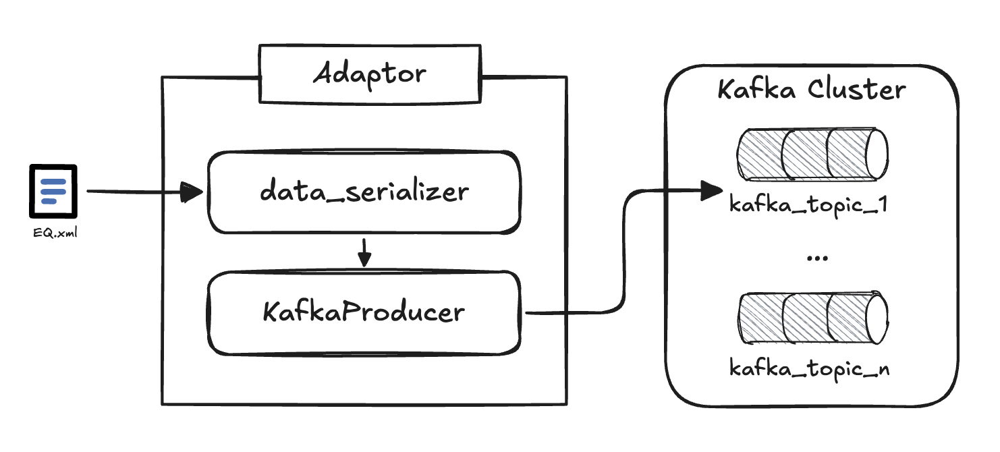

<h1 align='center'>
    <strong> Data Pipelines </strong>
</h1>

<p align='center'>
    A collection of data pipelines for the DSI (Data Sharing Infrastructure).
</p>

## **A. Disclaimer**

The software included in this repository is intended for pilot use only and is recommended for deployment in a sandbox environment.

## **1. Intro**

Data pipelines are a collection of components that perform a set of operations over a data source with the purpose of transforming it into a desired output.

This repo contains a collection of data pipelines that perform different operations over the data.

[`telicent-lib`](https://github.com/telicent-oss/telicent-lib) is a Python package that contains all the components that can be used to build the data pipelines.

### **1.1. Background Knowledge**

It's important to take into account that pipelines can be built by using two different components: `adapters` and `mappers`.

#### **1.1.1. Adaptor**

Component that is responsible for the ingestion of data from an external source.



This component can be used in a multitude of use cases as long as you duly adapt the code to the specificities of the data source. Up until this point, we've used this component to read from a file and insert the data into a Kafka topic, but it can also be used to read data from the Azure Blob Storage - which has been the pattern used for the pipelines in this repo - and insert it into a Kafka topic.

#### **1.1.2. Mapper**

This component is responsible for performing transformations on the data.

The way this component work is by embedding the following capabilities:
- consume data from a specific Kafka topic;
- perform transformations on the data obtained;
- sink the transformed data into a specific Kafka topic.

Any transformation can be performed as long as it's encoded in the Python code and duly reflected in a mapping function.


## **2. Project Tree**

This project is structured as follows:

- [`/adaptor`](./adaptor): contains the code as well the configuration files for the deployment of the adaptor component;
- [`/mapper`](./mapper): contains the code as well the configuration files for the deployment of the mapper component. 
- [`/templates`](./templates): contains the templates for the adaptor and mapper components. Additionally, as templates for the mapper, we have mappers that perform the following operations:
    - `schema-assurance`: that validates the data against validation files (i.e. SHACL and Ontology) by leveraging the [`dsi-schema-assurance`](https://github.com/energy-dsi/dsi-schema-assurance) library;
  - `extractor`: that extracts data from a kafka topic and saves it into a file on the Azure Blob Storage;
  - `security-labels`: that adds security labels to the data.
- [`/pipelines`](./pipelines): contains pre-configured code both for a GitHub Actions pipeline as well as for an Azure DevOps pipeline;
- [`/tests`](./tests): contains the tests performed on the additional code;
- [`/smoke-test`](./smoke-test): contains the code for the smoke test performed on the pipelines, as well as the data that will be used to test the pipelines. Additionally, it contains the instructions to perform the smoke test;
- [`/blueprints`](./blueprints): contains the blueprints for the multiple components of the pipeline and for every data procuct (i.e. `EquipmentBoundary`, `EquipmentCore`, `DiagramLayout`, and `SteadyStateHypothesis`).

In the following diagram you can see the relationship between the different components of the pipeline that was used during the testing phase:


## **3. How to get the pipelines deployed**


Assuming that you have the **data pipelines components duly configured** and the **pipelines to publish them on container registry ready**, you can follow the steps below to get the pipelines deployed:

1. **Commit the changes** this will trigger the GitHub Actions/Azure DevOps pipeline;
2. **Check the pipeline logs** to make sure it went well;
3. **Check the container registry** to make sure the images were published;
4. **Add the images as part of the [flux configuration](https://github.com/energy-dsi/dpn-flux-deployment/tree/main)** so they can be deployed on the target environment;
5. **Check the helm releases** on you k8s cluster to make sure the pipelines were deployed correctly;
6. **Let the magic happen**.

## **4. Configuration Instructions**

To configure and launch the data pipelines the following steps must be considered, **please bear in mind that the order the steps are appearing is the one we've been following**, but if you intend to start by the configuration of the github actions pipeline that shouldn't have implications on the final result.

### **4.a. Folder structure**

The structure we've been following is:

```bash
dsi-data-pipelines/
├── adaptor/
├── mapper/
```

Inside each of these folders you should replicate the component code **as many times as you want that component to be deployed**.

```bash
dsi-data-pipelines/
├── adaptor/
│   ├── diagram-layout/
│   ├── equip-boundary/
└── mapper/
    ├── schema-assurance-producer/
    ├── security-labels-producer/
    └── schema-assurance-consumer/
```

**On each of these folders you should have a copy of all the files needed** to deploy the component you want to deploy with the modifications needed to perform the operations around EventHub - that will be specified in the next sections.

```bash
dsi-data-pipelines/
├── adaptor/
│   ├── diagram-layout/
│   │   ├── charts/
│   │   ├── telicent-lib/
│   │   ├── .env
│   │   ├── Dockerfile
│   │   ├── producer.py
│   │   ├── requirements.txt
│   │   ├── utils.py
│   └── equip-boundary/
└── mapper/
    ├── schema-assurance-producer/
    │   └── equip-boundary/
    │       ├── charts/
    │       ├── telicent-lib/
    │       ├── validation_files/
    │       ├── .env
    │       ├── Dockerfile
    │       ├── mapper.py
    │       ├── mapping_function.py
    │       ├── requirements.txt
    │       └── utils.py
    ├── security-labels-producer/
    └── schema-assurance-consumer/
```

**_Note_**: if you end up configuring a mapper to schema-assurance, please **make sure you add the validation files required to run the validation process - SHACL and Ontology (_optional_) -** on the `/validation_files` folder with the names `ontology.rdf` and `shacl.ttl` respectively.

### **4.b. `telicent_lib`**

At the moment, `telicent_lib` original version doesn't yet allow operations around Azure EventHub. Due to that, our Engineering team made some adjustments to the code so it can be used on the pipelines.

**This means that for each pipeline component that requires this functionality, you should add the following folder: `telicent_lib` where you will find the original `telicent_lib` code with the necessary adaptations to perform the operations around EventHub.**

Eventually, this will be addressed on the `telicent_lib` repository so this step won't be needed anymore. Once that happens, `telicent_lib` folder can be removed from the pipeline component you're setting up and you only need to add the `telicent_lib` dependency on the `requirements.txt` file.

To follow the development around this new release, please check the [issue raised](https://github.com/telicent-oss/telicent-lib/issues/58).


### **4.c. Adapt the Chart template**

There's some files inside the Chart template that required editing/modifications considering the resources that will be targeted by the pipelines we want to create: 

1) `*/charts/templates/job.yaml`, 
2) `*/charts/values.yaml`, 
3) `*/.env`.

#### **4.c.1. `job.yaml`**

The specs chosen are both resultant from fine-tuning procedures we've held into account with previous deployments plus imposed by the vulnerabilities checks run previously.

If you end up changing the environment variables - which are entirely secrets -, please consider changing the code of the **adaptor/mapper** (depending on the component you're configuring) accordingly, otherwise errors will be raised.

Additionally, feel free to edit the space allocated to memory requests and the boundaries associated to the CPU **if necessary**.

#### **4.c.2. `values.yaml`**

In this file **it's mandatory to add a value to every configuration**.

Here's the list of configs that should be in these scripts:

- `kafka_server`: which is the `Host Name` associated to the Azure EventHub Namespace;
- `source_name` or `source_topic` - depending if we're configuring an adaptor or a mapper;
- `target_topic`: name of the topic where all the data will be sinked in;
- `producer_name` - if it's an adaptor: a name that will be associated to the producer component;
- `image_name`: that will target the container registry where the components are stored and the name of the image component;
- `image_semver`: the version of the image specified above.

**_Note_**: the topics specified on these files will be automatically added once you run the pipelines, there's no need to add these to the EventHub Namespace prior to that.

#### **4.c.3. `.env`**

The configuration of this file is straightforward and it depends on the component you're configuring.

If you're configuring an **adaptor**, you should add the following variables:
- `BOOTSTRAP_SERVERS`: the EventHub bootstrap server that you can obtain directly from the Azure portal;
- `STORAGE_ACCOUNT_URL`: the URL of the storage account that you want to use to read the data from;

If you're configuring a **mapper**, you should add the following variables:
- `BOOTSTRAP_SERVERS`: the EventHub bootstrap server that you can obtain directly from the Azure portal;
- `SOURCE_TOPIC`: the topic where the data will be read from;
- `TARGET_TOPIC`: the topic where the data will be sinked in;
- `CONTAINER_NAME` [if _extractor_]: the name of the container where the data will be saved;
- `FOLDER_NAME` [if _extractor_]: the name of the folder where the data will be saved;
- `FILE_NAME` [if _extractor_]: the name of the file where the data will be saved.


### **4.d. Deploy the pipelines**

To get the pipelines deployed into your platform you can leverage one of the two options below:

- `GitHub Actions`;
- `Azure DevOps`.

In both cases, the pre-configured code you'll find for both cases above, **is already prepared to navigate through the structure discussed on the [section above](#4a-folder-structure)**.

### **4.e. Add secrets to Kubernetes**

Once the pipelines are deployed, there's a set of secrets that need to be created on the k8s cluster to guarantee the normal functioning of the data pipelines: 

1) `eventhub-connection-string`, 
2) `blob-sas-token`, 
3) `blob-connection-string`.

First things first, you need to encode the secret obtained directly Azure portal through the following command:

```bash
echo "[SECRET_OBTAINED_FROM_AZURE]" | base64
```

From the command above, you will obtain an encoded secret that should then be used on the following command:
```bash
kubectl create secret generic blob-sas-token --from-literal=secret=[ENCODED_SECRET] --namespace=[K8S_NAMESPACE]
```

This **requires not only the creation of the namespace to be completed but also the config of kubectl to use the correct namespace**.

The latter might require the use of the following command:
```bash
kubectl config set-context [CONTEXT_NAME] \
  --cluster=[CLUSTER_NAME] \
  --user=[USER_NAME]
```

Where:
- `[CONTEXT_NAME]` is the name of the context you want to use;
- `[CLUSTER_NAME]` is the name of the cluster you want to use;
- `[USER_NAME]` is the name of the user you want to use.


